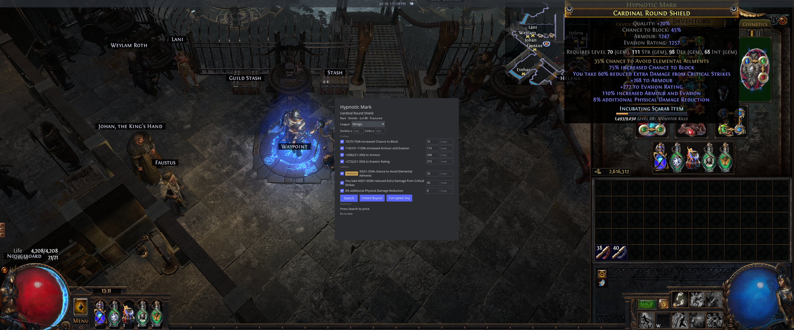

# poechk

A Path of Exile price-check overlay for the [COSMIC](https://system76.com/cosmic/)
desktop. Native Rust and Wayland — no Electron — in the spirit of
[Awakened PoE Trade](https://github.com/SnosMe/awakened-poe-trade), which does
not run well on Wayland compositors like COSMIC's.

Hover an item in game, press **Ctrl+Alt+D**, and a layer-shell overlay pops up
with the item parsed into adjustable trade filters and live prices from the
official trade site.



## Features

- **One-hotkey price check** — copies the hovered item (XTest into the
  XWayland game, the same mechanism Awakened uses) and opens the overlay
- **Interactive trade filters**, grouped by Enchants / Implicits / Prefixes /
  Suffixes: per-affix checkbox and editable min/max, applied when you press
  Search — adjust and re-search until the comparables make sense
- **Type badges** — `fractured` / `crafted` / `veiled` / `scourge` mods are
  labeled; click the badge to toggle between "must be that type" and "match as
  a plain explicit". Crafted mods start unchecked (buyers re-craft)
- **Pseudo totals** — spread resistances fold into `+#% total Elemental
  Resistance` (and total chaos res / total life), the way rares actually
  price; per-stat `pseudo` toggles search item-wide totals
- **Weapon DPS** — pDPS / eDPS / total DPS computed from the item and
  searchable as `weapon_filters`, dominant kind prefilled
- **Sockets/links, corrupted, and listing-status filters**; league picker
  fetched from the API and remembered
- **Currency, fragments, scarabs, essences, fossils, oils, and divination
  cards** price via poe.ninja — whose currency rates come from the in-game
  currency exchange — cached locally for 30 minutes
- **Open in browser** — jump to the exact search on pathofexile.com/trade
- Local/global stat disambiguation (`+# to Armour` on a chest is the Local
  stat), advanced and simple clipboard formats, eldritch implicits, and the
  official trade API's rate limits respected across runs

## Requirements

- **COSMIC desktop** (uses wlr-layer-shell for the overlay and COSMIC custom
  shortcuts for the hotkey; other wlr compositors are untested)
- **Path of Exile 1** running under Steam/Proton (XWayland) — PoE 2 support is
  planned
- English game client
- `wl-clipboard` (`wl-paste`/`wl-copy`)
- Clipboard access enabled in COSMIC: set `COSMIC_DATA_CONTROL_ENABLED=1`
  session-wide (e.g. in `~/.config/environment.d/cosmic.conf`, then re-log)
- Rust via **rustup** to build (distro Rust packages may fail the build)

## Install

```sh
cargo install --git https://github.com/jdoss/poechk
```

Then bind the hotkey in **COSMIC Settings → Input Devices → Keyboard →
Keyboard Shortcuts → Custom Shortcuts**:

| Field | Value |
|---|---|
| Name | poechk price check |
| Command | `/home/YOU/.cargo/bin/poechk check --copy` |
| Shortcut | Ctrl+Alt+D |

(Equivalent RON, if you prefer editing
`~/.config/cosmic/com.system76.CosmicSettings.Shortcuts/v1/custom` directly:)

```ron
(
    modifiers: [Ctrl, Alt],
    key: "d",
    description: Some("poechk price check"),
): Spawn("/home/YOU/.cargo/bin/poechk check --copy"),
```

## Use

1. Hover an item in game and press **Ctrl+Alt+D**.
2. The overlay opens with the item parsed: pseudo totals and prefilled affix
   filters (uniques start name-only; crafted mods and implicits start
   unchecked — tick the implicits you actually want to pay for).
3. Adjust — toggle affixes, edit min/max, cycle `Instant Buyout / Online /
   Any` and `Corrupted`, set sockets/links or DPS floors — then press
   **Search**.
4. Cheapest listings show as price bands with the total match count.
   **Open in browser** lands on the same search on the trade site.
5. **Esc** (or clicking away) closes the overlay.

Run PoE in **windowed fullscreen** — exclusive fullscreen can hold a keyboard
grab that blocks compositor shortcuts.

If you'd rather not have poechk inject the copy keystroke, bind the shortcut
to `poechk check` (without `--copy`) and press Ctrl+Alt+C yourself before the
hotkey.

## Logging in (optional)

Searches work without an account, but unauthenticated rate limits are low. To
search as your account (higher limits, private leagues), give poechk your
trade-site session cookie in `~/.config/poechk/config.toml`:

```toml
poesessid = "your-cookie-value"
```

Get the value from a browser logged into pathofexile.com: DevTools → Storage/
Application → Cookies → `POESESSID`. Treat it like a password — it is your
login. poechk only sends it to `www.pathofexile.com`.

## Logs

A check launched from a desktop shortcut has no terminal, so poechk writes to
`~/.local/state/poechk/`:

| file | contents |
|------|----------|
| `checks.jsonl` | one JSON object per event: the item text, the parsed item, the exact search body sent to the trade API, and the raw responses |
| `poechk.log` | the same messages that go to stderr |

Both roll over at 32 MB, keeping one previous file (`.1`). Every line of a
single check shares a `check` id, so to read the last check:

```sh
tail -1 ~/.local/state/poechk/checks.jsonl | jq -r .check |
  xargs -I{} rg '"check":"{}"' ~/.local/state/poechk/checks.jsonl | jq .
```

Useful when a price looks wrong: `search_req.body` is exactly what was asked
for, and `search_resp.body` is exactly what came back.

Your `POESESSID` is never written — only whether one was sent. Listings do
carry seller account names, so the log is about as private as your trade
history.

## How it works

One binary, no daemon. The COSMIC shortcut spawns `poechk check --copy`,
which seeds the clipboard with a sentinel, fakes Ctrl+Alt+C into the game via
XTest (PoE runs under XWayland), polls until the item text lands, parses it
against vendored stat/item data, and opens a wlr-layer-shell overlay
(libcosmic's iced fork) that talks to the official trade API — search +
fetch, honoring the `x-rate-limit-*` headers across runs. Exchange-traded
items skip the trade site and read poe.ninja's cached economy feed instead.

## Credits

- [Awakened PoE Trade](https://github.com/SnosMe/awakened-poe-trade) (MIT) —
  the reference for the parsing pipeline and the vendored stat/item data
  (see `NOTICE`), itself derived via [RePoE](https://github.com/brather1ng/RePoE)
- [poe.ninja](https://poe.ninja) — economy reference prices
- [libcosmic](https://github.com/pop-os/libcosmic) — layer-shell UI

poechk is fan-made and is not affiliated with or endorsed by Grinding Gear
Games. Path of Exile is a trademark of Grinding Gear Games.

## License

[MIT](LICENSE). The vendored `data/` files derive from Path of Exile game
data; see `NOTICE`.
